# So Do Tu Duy - Module 1: Kich Ban Nang Cao

> Ban canvas tuong tac: [Mo so do](./So-do-tu-duy_Module-1.html)

```mermaid
flowchart TB
    A["Module 1: Kich Ban Nang Cao"]

    A --> B["Nen tang"]
    B --> B1["Video affiliate: kich ban, video body, pre-hook"]
    B --> B2["Tu viet kich ban, khong sao chep template"]

    A --> C["Nguyen tac chung"]
    C --> C1["Mot nguyen nhan goc"]
    C --> C2["Cam xuc truoc, ly tri sau"]
    C --> C3["Giai phap hop ly, CTA tu nhien"]

    A --> D["Loai 1: Silent Symptom"]
    D --> D1["Dung khi: san pham gian tiep, can xay niem tin sau"]
    D --> D2["1. Dau hieu am tham"]
    D --> D3["2. Goi y van de phia sau"]
    D --> D4["3. Xac dinh nguyen nhan goc"]
    D --> D5["4. Khuech dai hau qua vua phai"]
    D --> D6["5. He lo giai phap tu nhien"]
    D --> D7["6. San pham va cung co niem tin"]

    A --> E["Loai 2: Symptom Labeling"]
    E --> E1["Dung khi: can hook nhanh, co authority voice"]
    E --> E2["1. Liet ke 5-7 trieu chung"]
    E --> E3["2. Pha niem tin cu"]
    E --> E4["3. Giai phap tu nhien hoac san pham"]
    E --> E5["4. Loi the san pham va CTA"]

    A --> F["Loai 3: Myth Busting"]
    F --> F1["Dung khi: thi truong bao hoa, co cau chuyen nguon goc"]
    F --> F2["1. Pha vo niem tin pho bien"]
    F --> F3["2. Dua ra giai phap vuot troi"]
    F --> F4["3. Su that co xua hoac bi lang quen"]
    F --> F5["4. Loi ich theo cam giac co the"]
    F --> F6["5. Chung thuc nguoi that"]
    F --> F7["6. San pham va chat luong"]
    F --> F8["7. Khan hiem va CTA cam xuc"]

    A --> G["Chon nhanh"]
    G --> G1["Can tao nhan thuc -> Loai 1"]
    G --> G2["Can hook nhanh -> Loai 2"]
    G --> G3["Can khac biet o thi truong bao hoa -> Loai 3"]

    classDef root fill:#0f766e,stroke:#99f6e4,color:#ffffff,stroke-width:2px
    classDef type fill:#1d4ed8,stroke:#bfdbfe,color:#ffffff,stroke-width:2px
    classDef topic fill:#fef3c7,stroke:#d97706,color:#1f2937
    class A root
    class D,E,F type
    class B,C,G topic
```

## 1. Nen tang cua Module

- Muc dich cua kich ban: truyen tai thong tin va dan nguoi xem den quyet dinh mua hang.
- Video affiliate gom 3 thanh phan: kich ban, video body (nhan vat AI trinh bay) va pre-hook 3-10 giay dau.
- Khoa hoc cung cap khung va cong cu de tu trien khai; khong nen phu thuoc vao template co san.
- Dau ra can duoc ca nhan hoa theo san pham, muc do hieu va kha nang sang tao cua nguoi viet.

## 2. Nguyen tac vang

1. **Mot video, mot nguyen nhan goc:** khong dua nhieu nguyen nhan vao cung mot thong diep.
2. **Cam xuc truoc, ly tri sau:** tao su quan tam va tu nhan ra van de truoc khi dua ly giai hay bang chung.
3. **Giai phap hop ly:** chuyen tu lo lang sang hy vong bang mot giai phap tu nhien, de hieu.
4. **CTA tu nhien:** phai nhu mot loi khuyen chan thanh, khong ep mua tho.
5. **Dung muc do canh bao:** Loai 1 nhan manh khong de thong diep tro thanh de doa qua muc.

## 3. Loai 1 - Silent Symptom -> Hidden Cause -> Natural Reveal

### Muc tieu va boi canh

- Giup nguoi xem tu nhan ra van de, xay dung niem tin sau va tao "aha moment".
- Phu hop khi san pham giai quyet van de gian tiep, kho ban bang CTA manh: hormone, tuan hoan, viem nhe, met moi man tinh, ngu khong sau.
- Hieu qua voi tap trung nien, lon tuoi va nguoi thich video giai thich/canh bao dai hon.
- Nen giu giong chia se kien thuc va canh bao chan thanh, khong lam video giong quang cao.

### Khung 6 phan

1. **Dau hieu am tham bi bo qua:** dua cac bieu hien nho, quen thuoc de nguoi xem tu lien he.
2. **Goi y van de phia sau:** lien ket cac dau hieu, cho thay chung khong phai ngau nhien.
3. **Xac dinh nguyen nhan goc:** giai thich toan bo trieu chung bang mot nguyen nhan duy nhat.
4. **Khuech dai hau qua:** cho thay rui ro neu keo dai, nhung khong hua doa qua muc.
5. **He lo giai phap tu nhien:** chuyen cam xuc tu lo lang sang hy vong; giai thich co che cua nguyen lieu.
6. **Gioi thieu san pham va cung co niem tin:** noi ro san pham chua giai phap do va ly do nen chon.

## 4. Loai 2 - Symptom Labeling -> Authority Voice -> Urgent Solution

### Muc tieu va dieu kien

- Tao hook rat nhanh trong 1-3 giay, nhip manh va truc dien.
- Su dung khi nguoi xem co cac trieu chung ro; san pham tac dong gian tiep hoac van de kha hoc/it pho bien.
- Can nghien cuu danh sach trieu chung ro rang, dang tin cay cua van de muon giai quyet.
- Can avatar AI co ve uy tin va chuyen nghiep (vi du bac si, dieu duong, chuyen gia), voice confident va hinh minh hoa tot.

### Khung 4 phan

1. **Liet ke trieu chung:** dua 5-7 trieu chung ngan, de dong cam; lap cau truc `trieu chung -> nguyen nhan` de dong dinh nhan thuc.
2. **Pha niem tin cu:** dung cong thuc `khong phai A, ma la B`; A la cach nguoi xem tu tran an (tuoi tac, stress binh thuong...), B la van de can giai quyet.
3. **Giai phap:** co the gioi thieu nguyen lieu tu nhien nhu Loai 1 hoac dua san pham vao truc tiep.
4. **San pham va CTA:** neu nhanh loi the canh tranh (chat luong, giao hang, su tien loi), sau do CTA ngan 1-2 cau.

## 5. Loai 3 - Myth Busting -> Ancient Truth -> Proof and Scarcity Close

### Muc tieu va dieu kien

- Tao khac biet khi thi truong da bao hoa va nguoi xem da nghe qua nhieu loi khuyen giong nhau.
- San pham can co nguyen lieu tu nhien va cau chuyen nguon goc/truyen thong de khai thac.
- Khong phu hop neu van de chua pho bien, thi truong it san pham thay the, hoac san pham thuan phong thi nghiem khong co yeu to tu nhien.
- Tam ly khai thac: con nguoi thuong danh su tin tuong nhat dinh cho thu lau doi, co chieu sau van hoa.

### Khung 7 phan

1. **Pha vo niem tin pho bien:** phu dinh manh va nhanh cac giai phap quen thuoc.
2. **Dua ra thu dung hon:** lap khoang trong niem tin bang mot giai phap thay the vuot troi.
3. **Su that co xua / bi lang quen:** ke cau chuyen van hoa, truyen thong cua nguyen lieu; chua gioi thieu san pham truc tiep.
4. **Loi ich theo cam giac co the:** mo ta trai nghiem de hinh dung (nhe bung, ngu ngon, it sung dau), tranh dien giai qua ky thuat.
5. **Chung thuc nguoi that:** 1-2 tinh huong/cam nhan don gian, cam xuc ro rang.
6. **San pham va chat luong:** gioi thieu san pham, nhan manh thanh phan va do tinh khiet/chat luong; khong so sanh lan man.
7. **Khan hiem va CTA cam xuc:** tao su thuc day bang so bo lo/het hang, nhung van gan gui va khong ep mua.

## 6. Bang chon nhanh

| Tinh huong | Loai phu hop | Cach vao bai |
| --- | --- | --- |
| San pham kho ban, can nguoi xem tu nhan ra van de | Loai 1 | Xay dung tu dau hieu den nguyen nhan |
| Can hook manh va day cam xuc ngay | Loai 2 | Liet ke trieu chung nhiet do, authority voice |
| Thi truong bao hoa, can tao su khac biet | Loai 3 | Pha niem tin cu va ke cau chuyen nguon goc |

## 7. Checklist truoc khi viet

- [ ] Xac dinh mot van de va mot nguyen nhan goc.
- [ ] Chon Loai 1, 2 hoac 3 theo boi canh thay vi dung mot khung cho moi san pham.
- [ ] Kiem tra trieu chung va loi ich duoc neu ra co co so dang tin cay.
- [ ] Viet hook dung nhip cua loai script da chon.
- [ ] Dua giai phap sau khi da tao du nhan thuc/cam xuc.
- [ ] Chot bang CTA ngan, tu nhien, khong gay ap luc.

---

Nguon tong hop: `Module-1-Kich-ban-nang-cao.pdf`, `modun 1 .txt`, `modun 1.2 .txt`, `modun 1.3.txt`.
